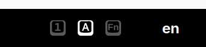
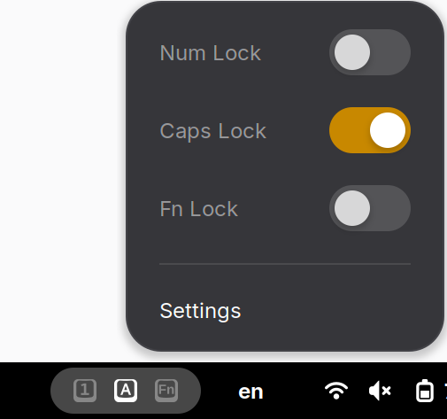
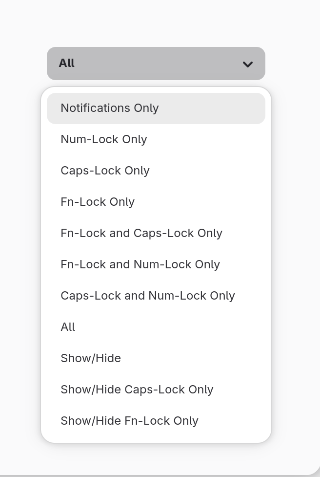

## Gnome shell numlock&capslock state indicator extension.

It shows notifications about numlock, capslock or fn lock state change.

NOTE: Fn Lock state will not work - no way of determining the Fn Lock state at this moment.

Screenshots

|Menu bar indicator|
|---|
||

|Menu bar context menu|
|---|
||

|Settings menu|
|---|
||

The original extension is available at (no fn-lock indicator): https://extensions.gnome.org/extension/36/lock-keys/

If you make any changes you can recompile the schemas file with the command `glib-compile-schemas <schemas-folder>`.

If you update the translations, run the `./po2mo.sh` script in the root directory.

In order to manually install this extension, copy lockkeys@vaina.lt to the:
~/.local/share/gnome-shell/extensions
